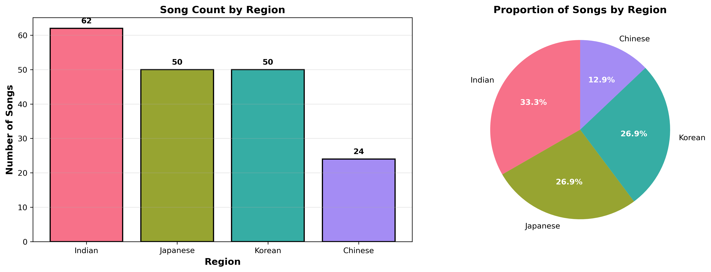
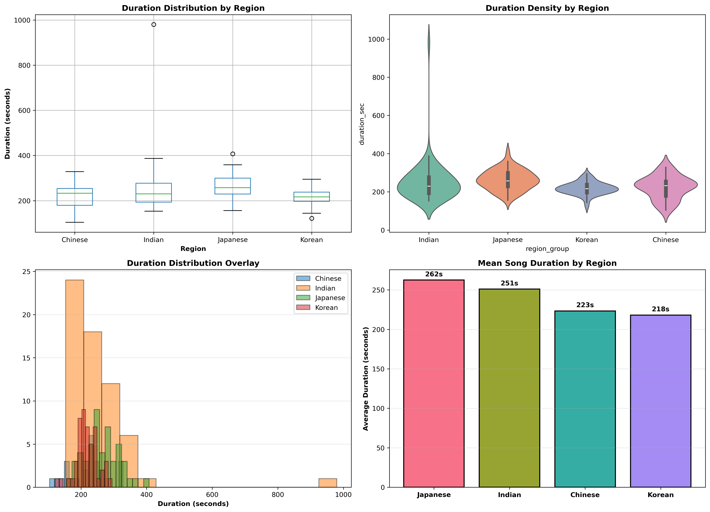
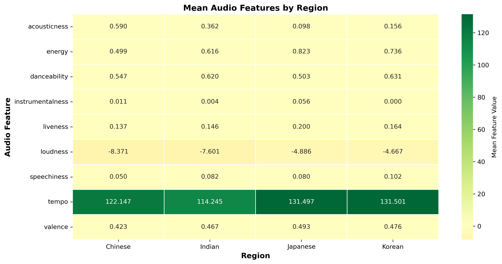
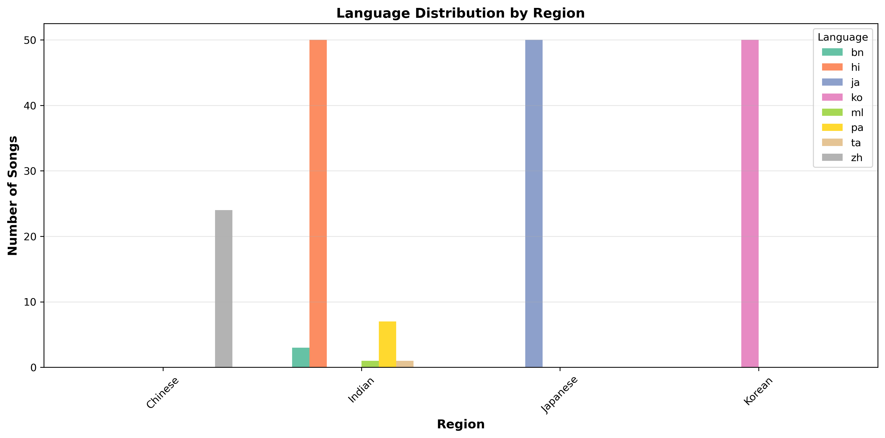
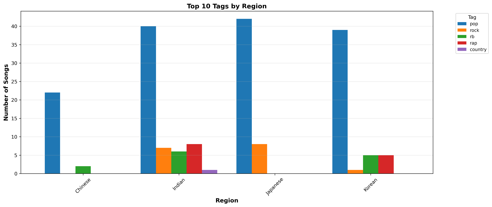
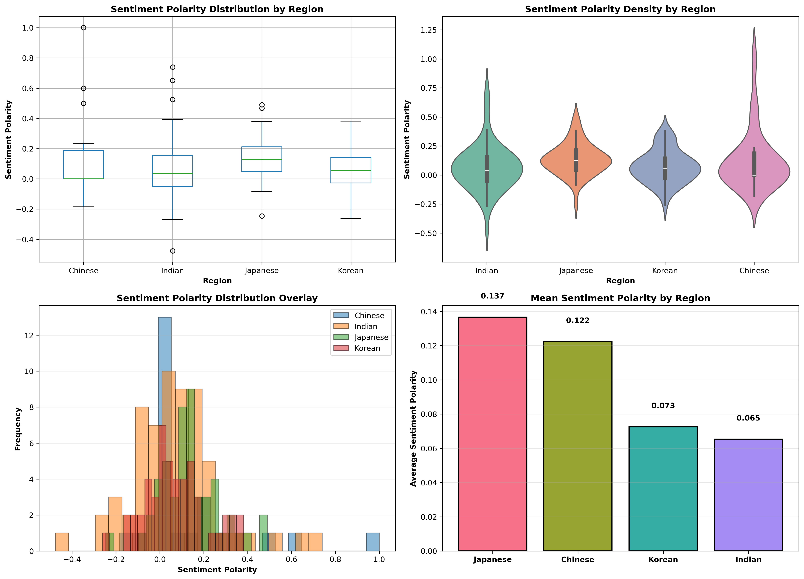

# Exploratory Data Analysis

Angela Chen, Samiksha Karimbil, Pragati Toppo

------------------------------------------------------------------------

## Dataset Selection

We are selecting these datasets because they are pretty comprehensive and we don't have to do any web scraping to get this information. Especially for Spotify metadata, the features they have such as 'danceability' seem to be pretty interesting and could differentiate between different genres (since we generally hypothesize that genres such as C-pop are more emo and therefore less 'danceable'). However, we think other features for the lyrics also can differentiate genres (i.e. we have observed that K-pop has a lot of repetitive choruses). As such, our dataset will be made by joining the Genius song lyrics dataset with the Spotify Tracks Metadata dataset. However, this join narrows down the available data significantly as you will see below.

We are also really only interested in scoping to differentiate between Asian pop, and so we chose to only include songs that are Chinese/Japanese/Korean/Indian (which we filtered by language code).

Our final data we are analyzing can be found in `data/asian_songs_translated_w_metadata_lyric_features.parquet`. The code to make this dataset can be found in `eda/eda.ipynb`. To run the notebook, you must first ensure that you download the csv data from the links below and convert to parquet (respectively, name them `song_lyrics.parquet` and `song_metadata.parquet`).

### Download Source Data:

Genius Song Lyrics: https://www.kaggle.com/datasets/carlosgdcj/genius-song-lyrics-with-language-information/data

Spotify Tracks Genre: https://www.kaggle.com/datasets/thedevastator/spotify-tracks-genre-dataset/data

------------------------------------------------------------------------

## Key variables, data volume, missingness, and potential target or interaction signals.

Key columns/variables: title, tag (music type), artist, year, views (Genius lyrics views), popularity, duration_ms, acousticness, explicit, danceability, key, loudness, speechiness, liveness, valence, tempo, clean_lyrics, lyrics_translated, word_count, unique_words, repetition_ratio, lexical_diversity, embeddings, sentiment_polarity, region_group

To keep the data balanced, we wanted to aim to have roughly the same number of songs within each genre. We were aiming for around 50 for each genre, but unfortunately Chinese is lacking with only 24 songs.

Song counts:\
Indian - 62\
Japanese - 50\
Korean - 50\
Chinese - 24

For this data, however, at least all of the columns are filled.

------------------------------------------------------------------------

## Informative visualizations

### 1. Region Distribution

**Key Findings:** - Indian pop dominates the dataset with 62 songs (33.3%) - Japanese and Korean are balanced with 50 songs each (26.9%) - Chinese pop is underrepresented with only 24 songs (12.9%) - Baseline accuracy (always predicting Indian): **33.3%**

This class imbalance is important for model development—we should use stratified cross-validation and consider class weights during training.

------------------------------------------------------------------------

### 2. Duration Analysis by Region

**Key Findings:** - **Japanese songs are longest**: 262 seconds (4:22) on average - **Korean songs are shortest**: 218 seconds (3:38) on average - **Duration difference**: 44 seconds between Japanese and Korean (statistically significant, p\<0.01) - **Variability**: Indian songs show the widest range (153s - 980s), suggesting more diverse song lengths - Japanese songs are more consistent in length (narrow distribution)

**For Classification:** Duration is a strong discriminator, especially between Japanese and Korean songs. This will likely be one of the top predictive features.

------------------------------------------------------------------------

### 3. Audio Features Heatmap

**Key Findings by Feature:**

| Feature          | Highest                      | Lowest             | Difference |
|-----------------|-----------------|-----------------|----------------------|
| **Acousticness** | Chinese (0.590)              | Japanese (0.098)   | 0.492      |
| **Energy**       | Japanese (0.823)             | Chinese (0.499)    | 0.324      |
| **Danceability** | Korean (0.631)               | Japanese (0.503)   | 0.128      |
| **Tempo**        | Chinese & Korean (131.5 BPM) | Indian (114.2 BPM) | 17.3 BPM   |

**Regional Audio Profiles:**

-   **Japanese**: High energy (0.823), low acousticness (0.098), moderate danceability → Electronic, energetic pop
-   **Chinese**: High acousticness (0.590), lowest energy (0.499), slower tempo → More acoustic, ballad-heavy
-   **Korean**: High danceability (0.631), high energy (0.736), high tempo (131.5) → Dance-oriented K-pop
-   **Indian**: Moderate across most features, moderate danceability (0.620), slower tempo (114.2) → Diverse, varied style

------------------------------------------------------------------------

### 4. Language Distribution by Region

**Key Findings:** - **Chinese**: 100% Mandarin (24 songs) - perfect language-region mapping - **Japanese**: 100% Japanese (50 songs) - perfect language-region mapping - **Korean**: 100% Korean (50 songs) - perfect language-region mapping - **Indian**: Mixed languages (Hindi, Bengali, Punjabi, Malayalam, Tamil) - reflects India's linguistic diversity

**Implication:** Language is highly predictive for region classification, though Indian pop shows the most variation.

------------------------------------------------------------------------

### 5. Music Tags by Region

**Key Findings by Region:**

-   **Chinese**: Dominated by pop (21 songs), limited genre diversity (only \~2 other tags)
-   **Indian**: Most diverse tag distribution - pop (40), rock (7), R&B (6), rap (8), country (1)
-   **Japanese**: Nearly all pop (43 songs), with minimal rock (8) and R&B (6)
-   **Korean**: Almost exclusively pop (39 songs), some R&B (5) and rap (5)

**Interpretation:** - Pop is dominant across all regions, which makes sense for our dataset - Indian music shows the most genre diversity, possibly reflecting the variety of Indian popular music styles - Chinese and Japanese datasets are more homogeneous (mostly pop) - K-pop is almost entirely classified as "pop" despite being its own distinct genre

------------------------------------------------------------------------

### 6. Sentiment Polarity Analysis

**Mean Sentiment Polarity Ranking:** 1. **Japanese: 0.137** - Most positive lyrics  2. **Chinese: 0.122** - Second most positive 3. **Korean: 0.073** - Neutral-leaning 4. **Indian: 0.065** - Most neutral (least positive)

**Distribution Characteristics:**

-   **Indian songs**: Widest range (-0.4 to 1.0), most variation in emotional tone
-   **Japanese songs**: Concentrated, consistent positive sentiment across songs
-   **Korean songs**: Centered around neutral (0.0), balanced emotional content
-   **Chinese songs**: Spread across range, but peaks slightly positive

**For Classification:** Sentiment polarity could be a useful feature, showing that Japanese pop tends to have more positive lyrics while Korean and Indian pop are more emotionally neutral/varied.

------------------------------------------------------------------------

## Initial ideas for features and any anticipated challenges

The most promising features that we would like to explore out of all the available columns would be repetition_ratio, lexical_diversity, sentiment_polarity, embeddings, tempo, key, duration_ms, and tag.

We should avoid using the features of title, artist, clean_lyrics, and region_group because those give away the genre pretty explicitly rather than having us try to find the latent features underlying the different genres. region_group would be our ground truth as to what genre each song is. If the Spotify metadata seems to be not that promising or if we have too little data, we can attempt to just use the Genius song lyrics metadata with our extracted features because they have a lot more variety of songs.

Another issue is that some of the songs we selected may be from a lesser variety of artists than we hope (i.e. a lot of the K-pop is BTS).
