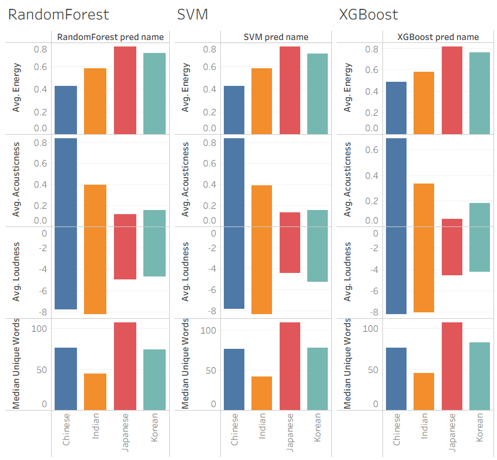

# **International Pop Genre Classification + Extension to American Pop**

**Angela Chen, Pragati Toppo, Samiksha Karimbil**
---

## **1. Introduction**

As music from Asian countries becomes more mainstream in American media, we have also found ourselves becoming avid listeners of this music. Despite not being able to understand the lyrics, we enjoy these forms of music. For our final project of the Knowledge Discovery from Data class, we wanted to see if these genres are distinguishable based on audio features and lyrics alone. 

Our project uses machine learning to classify a given song into one of the four languages based on limited features. After finding the best model, we also thought it would be interesting to take American pop music and classify it as well. This resulted in some very interesting findings that we discuss below.

We believe our results to be accurate because of the evaluation metrics, and also as regular listeners of these four genres, we feel that the model was able to accurately extract key distinguishing features of the music.

---

## **2. Dataset and Preprocessing**

### **2.1 Dataset Overview + Feature Extraction**

Our dataset consists of music across 4 languages. After preprocessing (combining lyrics and metadata from our Genius lyrics and Spotify metadata datasets), we obtained 62 Indian, 50 Korean, 50 Chinese, and 24 Chinese songs. This is a lot less data than we initially expected (with thousands of songs in the original datasets), but it makes sense considering the difficulty of joining on title/artist that may have slight differences between the datasets. We attempted to alleviate this difference by normalizing the text and making a join key, yet this is our result. This imbalance is a central challenge throughout the project.

At this point, the dataset includes title, tag (genre), artist, year, views, features, lyrics, id, language, region_group, join_key, popularity, duration_ms, acousticness, explicit, energy, danceability, key, loudnes, mode, speechiness, instrumentalness, liveness, valence, tempo.

After creating this combined dataset, we cleaned the lyrics to remove text such as '[CHORUS]' and then translated all of the lyrics to English to avoid data leakage. We then extracted features from the lyrics such as word_count, unique_words, repetition_ratio, lexical_diversity, sentiment_polarity, and embedding (of the lyrics). We chose to extract these features because we were curious whether there was a common sentiment or theme among songs of certain genre, as well as patterns in the range of vocabulary used.

### **2.2 Train/Test Split**

To evaluate model generalization, we used an 80/20 split, with stratification to preserve genre proportions as well as possible given the imbalance. Our true label of the genre was region_group. We decided not to include columns such as title, artist, year, views, features, lyrics, id, language, join_key, popularity, explicit, and clean lyrics because we either thought they were irrelevant or had little relevance, or because we thought that having those would be too obvious as too what genre it is (i.e. a Chinese song having a Chinese title, or BTS having a K-pop song). In most of the models, we also chose to just use the numerical fields as it was easier to develop compared to including categorical fields as well.

---

## **3. Models and Methods**

We trained several models to compare classical, ensemble, and gradient-boosting approaches:

* **Baseline Dummy Classifier**
  Predicts the most frequent genre (Indian).
* **Support Vector Machine**
* **Random Forest**
* **XGBoost Classifier**

For each model, we computed:

* Accuracy
* Precision, Recall, F1-score
* Confusion matrix
* ROC and PR curves 

Hyperparameters were initially left at defaults to establish a comparison baseline.

---

## **4. Results and Observed Behavior**

### **4.1 Identical Accuracy Concern**

Across several trained models we observed identical accuracy values, which initially raised concerns. However, this is explainable given:

* A small test set of 38 songs
* 13/38 songs (34%) are of an Indian language
* Models sometimes overfitting to the majority genre
* Different confusion matrices but identical overall accuracy

Small datasets create high variance in accuracy metrics, making it difficult to distinguish model quality.

### **4.2 Model Comparison**

We observed several noteworthy patterns:

* **Random Forest achieved perfect AUC (1.0)**, strongly suggesting overfitting.
  With so few training examples, deep trees may memorize noise or playlist-specific patterns.

* **XGBoost achieved high but not perfect AUC**, indicating it is actually learning discriminative structure rather than memorizing.

* **XGBoost performed slightly better than SVM**, particularly in classifying Japanese songs

In the end, we chose to go with XGBoost as our final model for American music classification.

### **4.3 Feature Importance Analysis**

We found the top important features from our model. Since it is hard to understand the actual meaning behind these specific embeddings, we looked at the other features than are more human-understandable to understand what actual patterns the model is training on.

These results seem to be pretty intuitive, as we will discuss in our later section on American Music Classification.

---

## **5. Limitations and Sources of Bias**

Several factors significantly impact model reliability:

### **5.1 Dataset Imbalance**

The dominance of Indian songs causes models to:

* Favor predicting the Indian class
* Struggle to learn minority genres
* Exhibit inflated accuracy despite poor real-world performance

### **5.2 Small Training and Test Sets**

With only 38 test samples:

* Accuracy fluctuates unpredictably
* Minor changes in predictions produce large swings
* Overfitting becomes extremely easy

---

## **6. American Music Classification**

When we used our model to classify American songs, we found these interesting features per genre:
- Korean pop - The songs that got classified as Korean tended to be the ones that were more popular. They had basic pop beats and repetitive choruses, with catchy hooks that were easy to sing along to. This is very telling of the earworm-like music that the Kpop industry frequently pushes out. It also makes sense that Kpop has almost become mainstream, and the top groups such as BTS and Blackpink have become household names.
- Chinese pop - The songs classified as Chinese had lyrics that were more emotional and meaningful in nature. They were instrument heavy and focused on the deeper meanings. This checks out, as Chinese music often carries themes of romance or heartbreak.
- Japanese pop - The songs that were classified as Japanese are commonly described as 'emo' music. The lyrics and sound carry stronger emotions of angst and pain. We find this to be accurate because popular music from Japan is often rock music which carries these themes.
- Indian pop - The songs classified as Indian were more upbeat and held a more shallow meaning than the others. A majority of popular music in India does not hold a lot of deeper meaning, mainly focusing on having fun or being in love, so we felt this was fairly accurate as well.
 
---

## **7. Conclusion**

This project explores the challenges and possibilities of machine-learning-based music genre classification using a small, imbalanced dataset. Our analysis shows:

* Gradient-boosting models such as XGBoost learn meaningful structure but are constrained by data limitations.
* Ensemble methods like Random Forest risk severe overfitting without depth constraints.
* Dataset imbalance dominates evaluation metrics, making accuracy a misleading measure.
* Visualization through ROC, PR curves, and feature importance provides essential evidence of model behavior.

Despite these limitations, our system demonstrates early signs of effective genre classification and establishes a foundation for more sophisticated models. Future work in dataset expansion, regularization, and cross-validation will allow us to evaluate model performance more reliably and build a classifier that generalizes to all languages.

---
